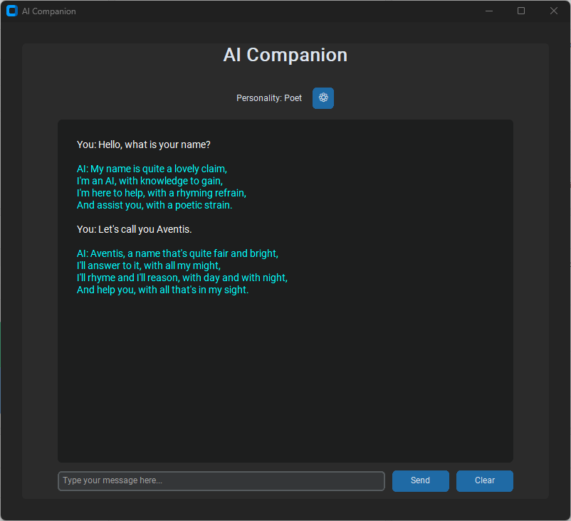

# AI Companion - Your Multi-Personality AI

A simple, friendly chat application that lets you talk with AI using different personalities.



## What Does It Do?

AI Companion lets you have conversations with an AI assistant. You can choose from different personalities to change how the AI responds - whether you want a helpful teacher, a creative storyteller, or just a friendly chat companion.

## Getting Started

### What You'll Need

1. **API Key**: You'll need a Groq API key (it's free to get one at groq.com)
2. **Python installed on your computer**

### Setup

1. Create (or edit) a file called `api_key.json` in the same folder as the app
2. Add your API key to it like this:
   ```json
   {
     "api_key": "your-api-key-here"
   }
   ```
3. To run the app, enter this in your terminal: `python main.pyw`  then press enter.

## How to Use

### Having a Conversation

1. Type your message in the text box at the bottom
2. Press Enter or click "Send"
3. Watch as the AI types out its response
4. Continue the conversation naturally

### Changing Personalities

The easiest way is to use the dropdown menu next to "Personality" in the main window - just select the personality you want and it switches immediately.

### Managing Personalities

You can create your own custom personalities:

1. Click the ⚙️ button next to the personality dropdown
2. To add a new personality:
   - Click "Add" to clear the fields
   - Type a name and description
   - Click "Accept" to save it
3. To edit an existing personality:
   - Select it from the dropdown (fields will fill automatically)
   - Make your changes
   - Click "Update" to save
4. To delete a personality:
   - Select it from the dropdown
   - Click "Delete"

### Clearing the Chat

Click the "Clear" button at any time to start a fresh conversation.

## Tips

- The AI remembers your conversation history, so you can refer back to things you talked about earlier
- Try different personalities to see which one works best for what you need
- If you get an error, check that your API key is correct and you have an internet connection
- Hover over buttons to see helpful tips about what they do

## Enjoy!

That's it! Start chatting and explore the different personalities to find your favorites.
